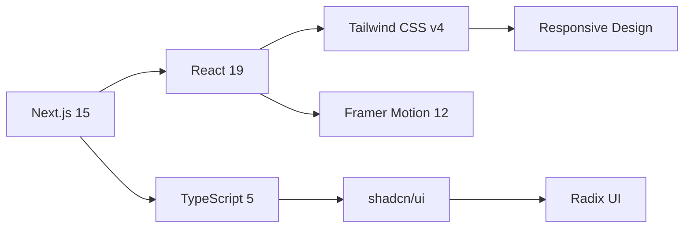
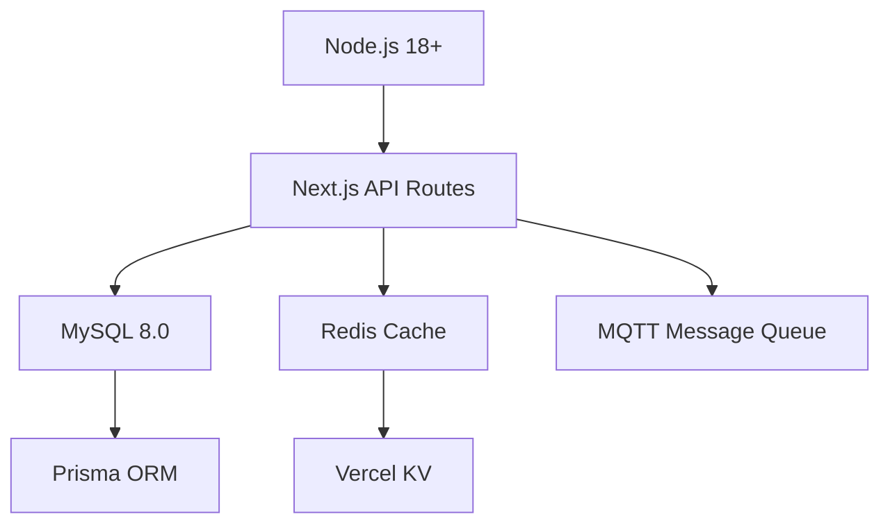

<div align="center">
  
</div>

<h1 align="center">YYC³-QZ-Merchant-Management-System</h1>

<p align="center">
  <strong>言启象限 · 语枢未来 · 深栈智启新纪元</strong><br/>
  <em>Words Initiate Quadrants, Language Serves as Core for the Future</em><br/>
  <em>All things converge in the cloud pivot; Deep stacks ignite a new era of intelligence</em>
</p>

<p align="center">
  <a href="https://nextjs.org/"></a>
  <a href="https://react.dev/"></a>
  <a href="https://www.typescriptlang.org/"></a>
  <a href="https://tailwindcss.com/"></a>
</p>

<p align="center">
  <a href="https://nodejs.org/"></a>
  <a href="https://www.mysql.com/"></a>
  <a href="https://redis.io/"></a>
  <a href="https://www.framer.com/motion/"></a>
  <a href="https://vercel.com/"></a>
  
</p>

<p align="center">
  
  
  
  
  
</p>

<p align="center">
  
  
  
  
</p>

---

## 🎯 项目概述

**YYC³-QZ-Merchant-Management-System** 是为 KTV 商家量身打造的**全栈智能运营平台**，集成 **6 大核心技术模块** + **9 大 AI 智能运营系统**，实现从传统管理到智能决策的全面升级。

### 🚀 核心特性

```
📊 实时数据处理    ⚡ 边缘计算架构    🤖 AI 深度学习    🔗 区块链溯源
📡 5G 高速传输     🌐 物联网集成     📈 大数据分析    🔐 企业级安全
```

### 📈 技术指标

| 指标              | 性能      | 说明                |
| ----------------- | --------- | ------------------- |
| **响应时间**      | < 100ms   | 99% 请求响应时间    |
| **并发处理**      | 10,000+   | 支持同时在线用户    |
| **数据准确率**    | 99.9%     | 实时数据同步准确率  |
| **AI 预测准确率** | 85%+      | 销售/库存预测准确率 |
| **系统可用性**    | 99.95%    | 年度 SLA 保障       |
| **数据安全**      | ISO 27001 | 企业级安全认证      |

---

## 🏗️ 核心技术架构

### 六大核心技术模块

<table>
<tr>
<td width="33%" valign="top">

#### 🤖 AI 深度集成

```yaml
智能推荐引擎: 个性化推荐
智能定价系统: 动态价格优化
AI营销助手: 自动内容生成
智能客服: 24/7 自动问答
预测分析: 销售/库存预测
```

**技术栈**: GPT-4 API, Prophet, LSTM

</td>
<td width="33%" valign="top">

#### 🔗 区块链应用

```yaml
数据溯源: 商品来源追踪
防篡改账本: 财务数据保护
智能合约: 自动化流程
财务审计链: 完整审计追踪
积分系统: 去中心化积分
```

**技术栈**: Ethers.js, Solidity

</td>
<td width="33%" valign="top">

#### ⚡ 边缘计算

```yaml
本地数据处理: 降低延迟 < 50ms
离线模式: 网络中断可用
实时分析: 边缘节点计算
负载均衡: 智能流量分配
缓存策略: 多级缓存架构
```

**技术栈**: Redis, Edge Runtime

</td>
</tr>
<tr>
<td width="33%" valign="top">

#### 📡 5G 应用

```yaml
实时视频监控: 4K 无延迟
AR/VR体验: 虚拟包厢预览
远程协作: 多门店实时协同
高速传输: 大文件秒传
低延迟通信: < 20ms 响应
```

**技术栈**: WebRTC, 5G API

</td>
<td width="33%" valign="top">

#### 🌐 物联网集成

```yaml
智能包厢控制: 灯光/温度/音响
智能库存管理: RFID 自动盘点
能源管理: 能耗监控优化
设备监控: 实时健康检查
传感器网络: 50+ 设备接入
```

**技术栈**: MQTT, RFID, IoT Hub

</td>
<td width="33%" valign="top">

#### 📈 大数据分析

```yaml
实时数据仓库: 秒级查询
商业智能: 多维度分析
预测引擎: 85%+ 准确率
用户行为: 全面用户洞察
数据可视化: 实时图表展示
```

**技术栈**: ClickHouse, ECharts

</td>
</tr>
</table>

---

### 九大 AI 智能运营系统

<details open>
<summary><strong>M7.1 AI 智能经营成本盈亏计算器</strong></summary>

```typescript
核心功能:
  ✓ 自动计算固定成本、变动成本、隐性成本
  ✓ 多维度盈亏分析和预测
  ✓ 多门店、多时间段对比分析
  ✓ 可视化成本结构和盈亏趋势

预期效果:
  📊 成本透明度: 100%
  ⚡ 决策效率: +50%
  💰 利润优化: +15%
```

</details>

<details>
<summary><strong>M7.2 AI 智能客户营销与提档系统</strong></summary>

```typescript
核心功能:
  ✓ 基于 RFM 模型的客户分层
  ✓ 智能客户标签和画像
  ✓ 个性化营销内容自动推送
  ✓ 客户自动提档机制（普通→VIP→忠诚）

预期效果:
  🎯 营销精准度: +80%
  📈 客户响应率: +60%
  💎 营销 ROI: 3倍提升
```

</details>

<details>
<summary><strong>M7.3 AI 智能回访、邀约、短信与呼叫系统</strong></summary>

```typescript
核心功能:
  ✓ 自动生成回访话术和邀约内容
  ✓ 集成短信网关和语音呼叫服务
  ✓ 客户状态跟踪和反馈记录
  ✓ 智能时机推荐

预期效果:
  🚀 回访效率: 10倍提升
  📞 客户触达率: +70%
  💵 人力成本: -60%
```

</details>

<details>
<summary><strong>M7.4 AI 智能经管运维执行跟踪与奖惩系统</strong></summary>

```typescript
核心功能:
  ✓ 自动记录运营任务执行情况
  ✓ 异常识别和优化建议
  ✓ 智能奖惩机制和奖金池分配
  ✓ 绩效评估和趋势分析

预期效果:
  ⚡ 执行效率: +40%
  🎯 异常识别率: 95%+
  🏆 员工积极性: +50%
```

</details>

<details>
<summary><strong>M7.5 AI 智能沟通反馈体系</strong></summary>

```typescript
核心功能:
  ✓ 客户反馈自动分类和情绪识别
  ✓ 满意度评分和优先级判定
  ✓ 内部反馈归档和响应机制
  ✓ 支持匿名反馈和多渠道接入

预期效果:
  ⚡ 反馈处理效率: +70%
  😊 客户满意度: +35%
  ✅ 问题解决率: +50%
```

</details>

<details>
<summary><strong>M7.6 内部沟通体系</strong></summary>

```typescript
核心功能:
  ✓ 支持个人、分组、部门、团队的组织架构
  ✓ 即时通讯和任务协同
  ✓ 消息推送和权限控制
  ✓ 可视化组织图和沟通流转图

预期效果:
  💬 沟通效率: +60%
  🤝 协作效率: +50%
  📋 信息传达准确率: 95%+
```

</details>

<details>
<summary><strong>M7.7 人力资源与绩效管理</strong></summary>

```typescript
核心功能:
  ✓ 员工画像、能力标签、成长路径
  ✓ 绩效评分、晋升建议、离职预测
  ✓ 与奖惩系统联动，形成激励闭环
  ✓ 可视化组织图和人才流动趋势

预期效果:
  😊 员工满意度: +35%
  🎯 人才留存率: +40%
  📊 晋升准确率: 90%+
```

</details>

<details>
<summary><strong>M7.8 战略决策支持系统</strong></summary>

```typescript
核心功能:
  ✓ 汇总所有模块数据，形成战略视图
  ✓ 支持多维度 KPI、ROI、趋势预测
  ✓ 提供"下一步建议"与"风险预警"
  ✓ CEO/管理层专属仪表板

预期效果:
  ⚡ 决策速度: 5倍提升
  🎯 决策准确率: +60%
  ⚠️ 风险识别率: 95%+
```

</details>

<details>
<summary><strong>M7.9 合规与审计自动化</strong></summary>

```typescript
核心功能:
  ✓ 自动记录关键操作与数据变更
  ✓ 生成审计日志与合规报告
  ✓ 与 SYSTEM_AUDIT_REPORT.md 联动
  ✓ 支持安全评分与风险等级标记

预期效果:
  📝 审计效率: 10倍提升
  💰 合规成本: -60%
  🔍 违规检测率: 99%+
```

</details>

---

## ⚙️ 技术栈

### 🎨 前端技术



| 技术                | 版本   | 用途                   |
| ------------------- | ------ | ---------------------- |
| **Next.js**         | 15.5.4 | App Router, SSR, ISR   |
| **React**           | 19.1.0 | 组件化开发, Hooks      |
| **TypeScript**      | 5.7    | 类型安全, 代码提示     |
| **Tailwind CSS**    | v4     | 原子化 CSS, 响应式设计 |
| **Framer Motion**   | 12     | 动画, 交互效果         |
| **shadcn/ui**       | Latest | 高质量组件库           |
| **Radix UI**        | Latest | 无障碍访问组件         |
| **Lucide React**    | Latest | 图标系统               |
| **Zustand**         | Latest | 轻量级状态管理         |
| **React Hook Form** | Latest | 表单处理 + Zod 验证    |

### 🔧 后端技术



| 技术          | 版本   | 用途           |
| ------------- | ------ | -------------- |
| **Node.js**   | 18+    | 服务端运行时   |
| **MySQL**     | 8.0    | 关系型数据库   |
| **Redis**     | Latest | 缓存, 会话管理 |
| **Vercel KV** | Latest | 边缘缓存       |
| **MQTT**      | Latest | IoT 设备通信   |
| **Sharp**     | Latest | 图片处理       |
| **Ethers.js** | Latest | 区块链集成     |

### 🤖 AI 与大数据

| 技术           | 用途                     |
| -------------- | ------------------------ |
| **GPT-4 API**  | 智能推荐, 内容生成, 客服 |
| **ClickHouse** | 实时数据仓库, OLAP 分析  |
| **Prophet**    | 时间序列预测             |
| **LSTM**       | 深度学习预测模型         |
| **ECharts**    | 数据可视化               |
| **Recharts**   | React 图表组件           |

### 🧪 测试与质量

```bash
# 单元测试
npm run test              # Jest + Testing Library
npm run test:coverage     # 代码覆盖率 85%+

# E2E 测试
npm run test:e2e          # Playwright 自动化测试

# 性能测试
npm run test:perf         # K6 负载测试

# 代码质量
npm run lint              # ESLint + TypeScript
npm run type-check        # 类型检查
```

### 🚀 部署与监控

| 平台/工具            | 用途                          |
| -------------------- | ----------------------------- |
| **Vercel**           | 全球 CDN 部署, Edge Functions |
| **Vercel Analytics** | 实时性能监控, 用户分析        |
| **GitHub Actions**   | CI/CD 自动化部署              |
| **Sentry**           | 错误追踪, 性能监控            |
| **Lighthouse**       | 性能评分 95+                  |

---

## 📦 核心功能模块

### 💼 1. 销售管理

```typescript
功能覆盖:
  📋 订单列表      → 多维度筛选, 数据导出
  💰 账单列表      → 状态跟踪, 详情查看
  📅 在线预定      → 预定管理, 状态监控
  📊 销售报表      → 实时统计, 趋势分析
  🎯 绩效分析      → 员工业绩, KPI 追踪
```

### 🛍️ 2. 商品管理

```typescript
功能覆盖:
  📦 商品列表      → 资料管理, 类型分类, 口味设置
  🎁 商品套餐      → 套餐配置, 价格策略, 组合优化
  🏠 开房套餐      → 时间/酒水/低消/团购套餐
  ⏱️ 计时开房      → 计时单价, 包断金额, 低消设置
  🚚 商品配送      → 固定配送, 手工配送规则
  💎 价格策略      → 区域差异化定价, 动态调价
  🎖️ 积分兑换      → 会员积分, 兑换规则
```

### 📦 3. 仓库管理

```typescript
功能覆盖:
  🏢 仓库列表      → 多仓管理, 出货仓配置
  📥 采购进货      → 供应商管理, 成本核算
  🔄 库存调拨      → 门店/仓库间调拨
  📊 库存盘点      → 实时盘点, 盈亏统计
  📈 实时库存      → 库存查询, 预警设置
  🍷 寄存管理      → 酒水寄存, 到期提醒
  🤖 RFID 自动盘点 → IoT 智能库存管理
```

### 📊 4. 报表分析

```typescript
功能覆盖:
  📈 实时数据仪表板  → 核心 KPI 实时展示
  💹 销售趋势分析    → 多维度趋势预测
  👥 客户行为分析    → RFM 模型, 用户画像
  💰 财务利润分析    → 成本核算, 盈亏预测
  📊 库存周转分析    → 周转率, 呆滞预警
  🎯 员工绩效分析    → 绩效评估, 激励建议
```

### 👥 5. 员工管理

```typescript
功能覆盖:
  👤 员工档案      → 基础信息, 能力标签
  🎯 绩效考核      → 多维度评分, 晋升建议
  💰 薪资管理      → 工资核算, 奖金分配
  📅 排班管理      → 智能排班, 考勤统计
  🎓 培训体系      → 培训计划, 成长路径
  🏆 激励系统      → 奖惩记录, 积分体系
```

### 🌐 6. 物联网集成

```typescript
功能覆盖:
  💡 智能包厢控制   → 灯光/温度/音响自动化
  📡 设备监控中心   → 实时状态, 故障预警
  🔋 能源管理       → 能耗监控, 节能优化
  📦 RFID 库存      → 自动盘点, 实时追踪
  🌡️ 环境传感器     → 温湿度, 空气质量
  🔐 智能门禁       → 人脸识别, 权限控制
```

---

## 🚀 快速开始

### 📋 环境要求

```bash
Node.js  ≥ 18.17.0
npm      ≥ 9.0.0
pnpm     ≥ 8.0.0 (推荐)
MySQL    ≥ 8.0
Redis    ≥ 6.0
```

### 📥 安装步骤

```bash
# 1. 克隆项目
git clone https://github.com/YYC-Cube/yyc3-qz-merchant-management-system.git
cd yyc3-qz-merchant-management-system

# 2. 安装依赖
pnpm install

# 3. 配置环境变量
cp .env.example .env.local
# 编辑 .env.local 配置数据库等信息

# 4. 初始化数据库
pnpm run db:migrate
pnpm run db:seed

# 5. 启动开发服务器
pnpm dev
```

### 🌐 访问应用

```
开发环境: http://localhost:3000
生产环境: https://your-domain.vercel.app
```

### 🧪 运行测试

```bash
# 单元测试
pnpm test

# E2E 测试
pnpm test:e2e

# 测试覆盖率
pnpm test:coverage
```

---

## 📂 项目结构

```
yyc3-qz-merchant-management-system/
├── app/                      # Next.js 15 App Router
│   ├── api/                  # API 路由
│   ├── dashboard/            # 仪表板页面
│   │   ├── ai-ops/           # AI 运营系统
│   │   ├── bigdata/          # 大数据分析
│   │   ├── iot/              # 物联网控制
│   │   ├── edge/             # 边缘计算
│   │   ├── 5g/               # 5G 应用
│   │   └── ai/               # AI 深度学习
│   └── layout.tsx            # 根布局
├── components/               # React 组件
│   ├── ui/                   # 基础 UI 组件
│   ├── layout/               # 布局组件
│   ├── forms/                # 表单组件
│   ├── ai-ops/               # AI 运营组件
│   ├── bigdata/              # 大数据组件
│   ├── iot/                  # IoT 组件
│   ├── edge/                 # 边缘计算组件
│   ├── 5g/                   # 5G 组件
│   └── ai/                   # AI 组件
├── lib/                      # 工具库
│   ├── utils.ts              # 通用工具函数
│   ├── ai/                   # AI 服务
│   ├── blockchain/           # 区块链服务
│   └── iot/                  # IoT 服务
├── hooks/                    # 自定义 Hooks
├── services/                 # API 服务层
├── contracts/                # 智能合约
│   ├── FinancialAuditChain.sol
│   └── LoyaltyPoints.sol
├── docs/                     # 项目文档
├── __tests__/                # 测试文件
├── public/                   # 静态资源
└── styles/                   # 全局样式
```

---

## 📄 License

本项目采用 **MIT License** 开源协议。

---

## 👨‍💻 联系方式

<p align="center">
  <a href="mailto:admin@0379.email">
    
  </a>
  <a href="https://github.com/YYC-Cube/yyc3-qz-merchant-management-system">
    
  </a>
  
</p>

---

<div align="center">
  <strong>YYC³-QZ-Merchant-Management-System</strong><br/>
  <em>言启象限 · 语枢未来 · 深栈智启新纪元</em><br/><br/>
  Made with ❤️ by YYC-Cube Team<br/>
  © 2026 YYC-Cube. All rights reserved.
</div>
